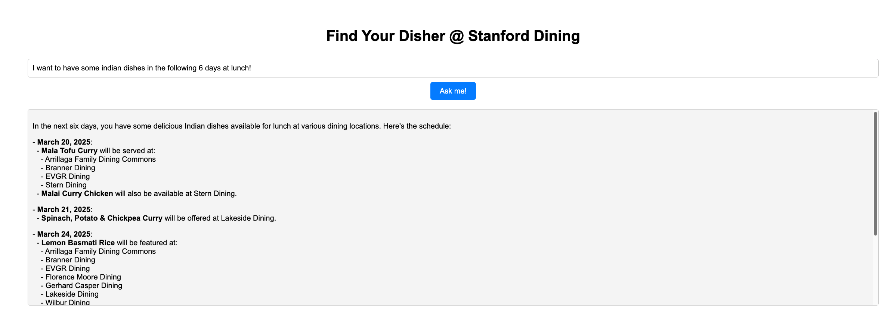

### Find Your Disher @ Stanford Dining
This project consists of two parts:
1. A AI-assisted ETL system.
2. Light-deployment with FastAPI and web interface.

With following features:
- [x] Extract data from Stanford Dining website with **Web Scraping**. Update the data automatically.
- [x] Automatically **structurize** the data with AI.
- [x] Understand query and **create SQL query** to retrieve data from database.
- [x] Generate **recommendation**.
- [x] **Deployment** with FastAPI and web interface.

The deployment is now available at [Find Your Disher @ Stanford Dining](https://fastapi-app-902489793845.us-central1.run.app/)

#### Website Preview
